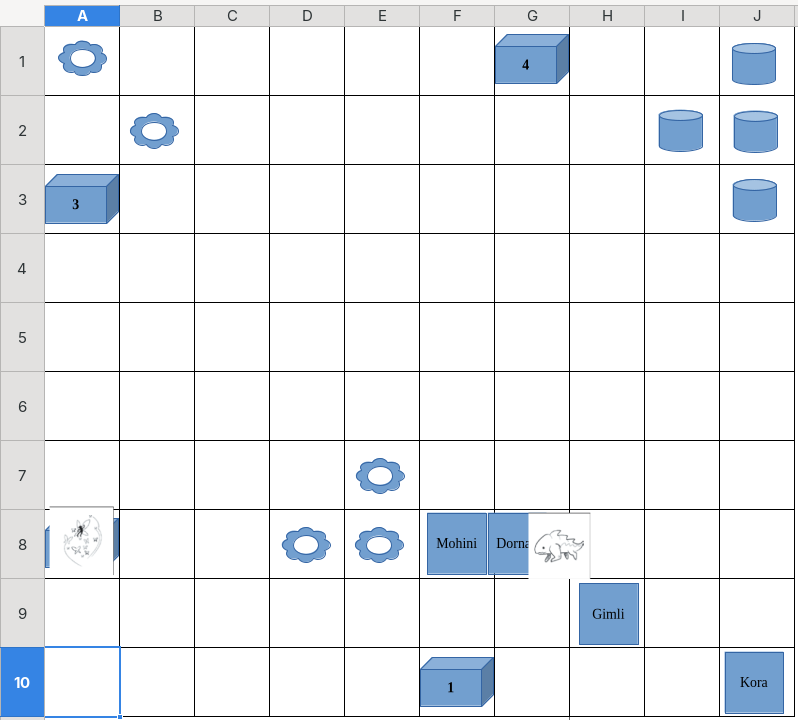
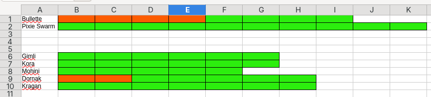

+++
date = '2026-08-14T08:54:25+05:30'
draft = false
showtoc = false
title = 'Session 01'
+++

# Session Summary

The adventurers returned to Mayor Bramble after successfully solving the missing pie mystery. While thanking them for their help, the Mayor noticed that the team lacked experience fighting monsters. He recommended the Monster Fighting Training Academy in Hesiod, run by Loomis, and asked the group to tell him that Mayor Bramble had sent them.

The Mayor also introduced them to Dornak, a Dragonborn Paladin and an in-experienced adventurer who wanted to train alongside the group.

The next day, the team travelled to Hesiod and joined the academy. Loomis began teaching them the basics of monster combat. After a week of training, the adventurers faced their final examination: fighting few monster in the academy's exam field.

## The Team
* Mohini — Bard
* Gimli — Cleric
* Kora Steelheart — Cleric
* Kragan "Mountain-Breaker" Ogolakanu — Barbarian
* Dornak — Paladin

## The Exam Battle

The battle began with the adventurers positioning themselves around the exam field while the monster waited.  Only Kragan was missing, as he was still asleep in his bed.

### Round 1

Dornak moved toward the monster and struck it successfully with his longsword. The others moved into position, preparing for the fight.

### Round 2

The monster attacked Dornak, biting him and dealing damage. Dornak retreated while the others advanced. Gimli attempted to cast Guiding Bolt, but the spell missed.

### Round 3

The monster swallowed Dornak!

Despite being inside the creature, Dornak attacked it with his longsword. The monster eventually spat him back out.

Kora then successfully struck the monster with Guiding Bolt, followed by Gimli hitting it with his mace. Mohini's rapier attack missed.

The combined attacks brought the monster down to half its health.

At that moment, Loomis decided to raise the stakes. He opened the cage containing a Pixie Swarm, releasing the swarm into the examination field.

The battle was far from over.

**To Be Continued...**

## Map

## HP

