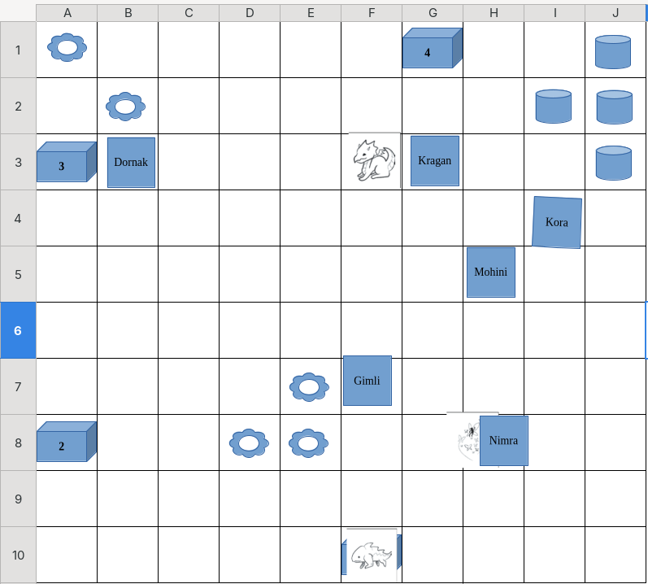
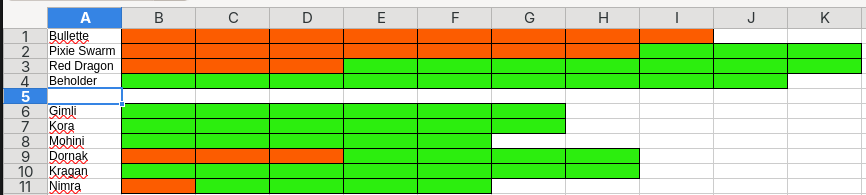

+++
date = '2026-08-21T21:47:51+05:30'
draft = false
title = 'Session 02'
+++

# Session Summary - The Exam Continues

The adventurers' combat examination continued in the academy's exam field, where the **Bullette** and the newly released **Pixie Swarm** were already waiting for them.

A new adventurer also joined the party: **Nimra Tumblefoot**. Nimra had been sleeping in the academy dormitories, where **Kragan** discovered her when he woke up. Kragan brought her along to the exam field, and she joined the party just as the battle continued.

## The Team
* [Mohini]() — Bard
* [Gimli]() — Cleric
* [Kora Steelheart]() — Cleric
* [Kragan "Mountain-Breaker" Ogolakanu]() — Barbarian
* [Dornak]() — Paladin
* [Nimra Tumblefoot]() - Monk

## The Battle

### Round 4

The Bullette attacked **Gimli**, but missed. The Pixie Swarm also attacked **Mohini**, but failed to hit her.

Gimli struck the Bullette successfully with his mace. Mohini attempted to attack with her rapier but missed, while Dornak's Fire Bolt also failed to hit.

Nimra made her first attack as a member of the party, successfully striking the Pixie Swarm with a dart.

Kora attempted to hit the Bullette with **Guiding Bolt**, but missed. Kragan then charged in and successfully struck with his axe.

### Round 5

The Pixie Swarm attacked Nimra but missed, while the Bullette also failed to hit Dornak.

Gimli successfully struck the Bullette with **Guiding Bolt**. Nimra followed up with another successful dart attack against the Bullette.

The combined attacks finally brought the Bullette down. **Loomis** moved the defeated creature back into its cage.

But the examination was not over.

Loomis opened another cage and released a **Red Dragon** into the arena.

Dornak attempted to strike the dragon with his longsword but missed. Kora moved into position and successfully hit the Pixie Swarm with a **Lightning Bolt**. Kragan also struck the Pixie Swarm with his axe.

### Round 6

The Pixie Swarm once again attacked Nimra but missed. The newly released Red Dragon attacked Dornak but also missed.

Gimli successfully attacked the Pixie Swarm with **Flames**, followed by Mohini successfully striking it with her rapier.

Dornak attempted to attack the Red Dragon with his breath weapon, but missed.

Nimra continued proving herself in battle, successfully attacking the Pixie Swarm with her quarterstaff.

Kora turned her attention to the Red Dragon and successfully struck it with flames.

Kragan moved toward the Pixie Swarm and attacked it with his axe.

### Round 7

The Pixie Swarm finally managed to hit Nimra, placing her under its magical spell for the round.

The Red Dragon attacked Dornak with fire, burning him.

While the party repositioned themselves around the arena, Nimra remained under the Pixie's influence. Forced to attack her own companions, she targeted Kora but fortunately missed.

Kora moved closer to the Red Dragon and successfully attacked it with flames.

Kragan then charged toward the Red Dragon and successfully struck it with his axe.

The battle continued with the party now facing the Red Dragon while still dealing with the dangerous Pixie Swarm.

**To Be Continued...**

## Map

## HP

